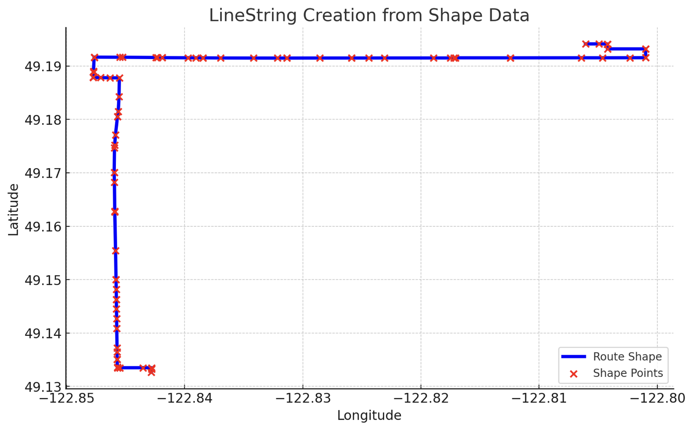
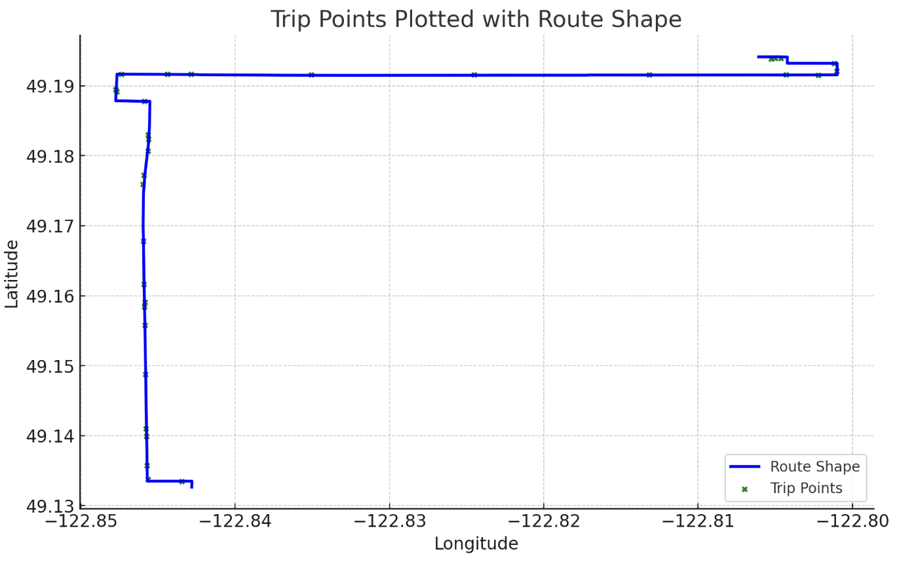
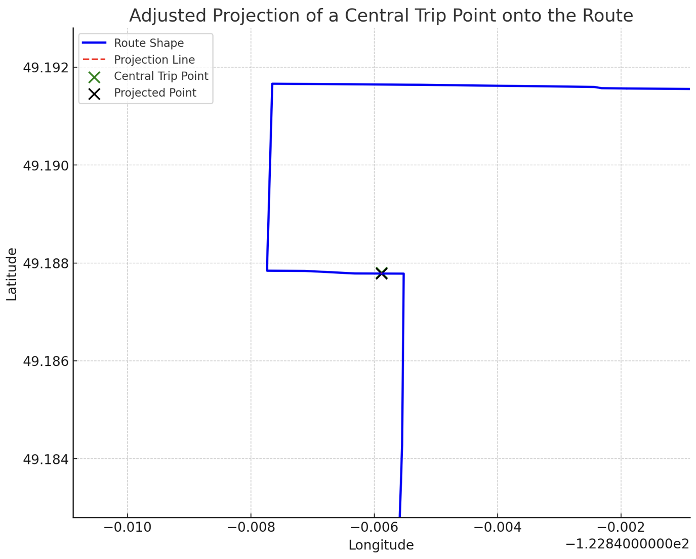
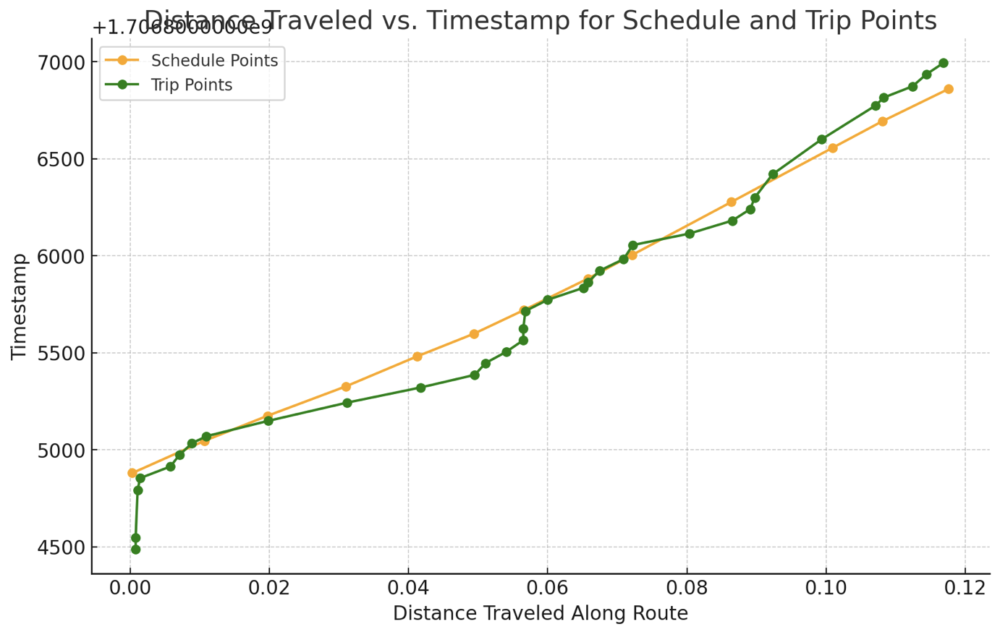
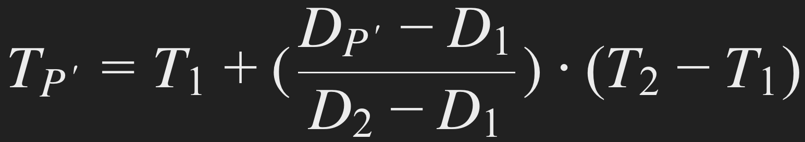

# GeoSpatial Schedule Interpolator

## Overview

This project provides a simple Python algorithm designed for analyzing and predicting schedules for delivery or transportation routes with fixed stops. By accepting an ordered tuple of locations to define a line string, the module can process schedules and predict schedule times for specific locations based on weighted interpolation of reported timestamps along that line string. It is particularly useful for applications in delivery services, public transportation, and any scenario involving fixed routes and schedules.

## Steps

The first step involves constructing a LineString object from a list of (longitude, latitude) tuples. This object represents the route's path.



Trip points, which may not lie directly on the LineString, are projected onto it. This step identifies the nearest point on the LineString for each trip point, effectively aligning trip data with the route.




We calculate the cumulative distance from the start of the LineString to each projected point. This distance measurement is crucial for timestamp interpolation. Of note, you may need to denoise your data for unwanted trip timestamps such as the beginning of the trip shown below. Also, ensure to convert your timestamps to epoch and watch out for line string segments that are intersecting or overlapping to make sure the interpolation project a point to the appropriate segment of the line string.



Timestamps for trip points are estimated using a weighted interpolation method based on their calculated distances along the LineString. Given the nearest two trip known timestamps ```T1``` and ```T2``` at distances ```D1``` and ```D2``` , and a point between them, the timestamp is interpolated as follows:



Where: 
```T predicted```: The time at which you predict you will reach the current distance.

```T prev```:  The last known timestamp.

```T2−T1```: The time duration between two known timestamps, which is used as a scaling factor for the weighted duration.

```Wi```: Represents the weighted impact of the current segment's pace relative to the sum of the remaining segments' paces, taking into account their distances. It's the ratio of the current segment's scheduled pace to the cumulative pace of all remaining segments, each multiplied by their respective distances. This factor adjusts the prediction to account for changing conditions over the course of the journey.

```P prev to current```: The pace for the most recent segment for which you have both distance and known or predicted time data.

```D current−D prev```: The incremental distance for which you want to predict the time of arrival.

```ΔDi```: The difference in distance for the ```ith``` segment of the remaining prediction points.

```Pi```: The schedule pace for the ```ith``` segment, which could be different for each segment n.

```n```: The number of remaining points for which you want to predict the time, including the current segment + 1.

Handling Edge Cases for Beginning and Ending Tails:

Beginning Tail: For points before the first known timestamp, extend the interpolation backward using the speed calculated between the first two known timestamps of the schedule.
Ending Tail: Similarly, for points after the last known timestamp, extend the interpolation forward using the speed calculated between the last two known timestamps of schedule.

The algorithm also returns three penalty factors inculding:

```'dist_to_closest_ts'``` : distance to the closest timestamp that was used for interpolation. The higher > less accuracy.

```'time_to_closest_ts'``` : time to the closest timestamp that was used for interpolation. The higher > less accuracy.

```'trip_to_schedule_ts_ratio'``` : ratio of the trip timestamps to the schedule timestamps. The higher > more accuracy

## Installation

This project is implemented in Python, leveraging Shapely for geometric calculations and Pandas for data management. It focuses on accurate geometric projections and effective temporal interpolation. To use this project, you'll need Python installed on your system. This project has been tested with Python 3.8+, but it may work with other versions. You can install the required dependencies with pip:

pip install -r requirements.txt

This command will install all necessary libraries, including Shapely, GeoPy, Pandas, and NumPy, as specified in the `requirements.txt` file.

## Usage

First, import the module in your Python script:

```python
from src.lstspred import LineStringConstructor, RoutePlan, TimeStampPredictor
```

Defining a Line String
Create a line string by providing an ordered list of tuples, each representing a location's longitude and latitude:

```python
locations = [(longitude1, latitude1), (longitude2, latitude2), ...]
line_string = LineStringConstructor(locations)
```

Creating a Schedule
Define a schedule with locations and timestamps:

```python
schedule = [(longitude1, latitude1, timestamp1), (longitude2, latitude2, timestamp2), ...]
route_plan = RoutePlan(schedule, line_string)
```

Predicting Schedule Times
To predict schedule times based on a trip's reported timestamps:

```python
trip = [(longitude1, latitude1, timestamp1), (longitude2, latitude2, timestamp2), ...]
trip_plan = RoutePlan(trip, line_string)
predictor = TimeStampPredictor(route_plan, trip_plan)
predicted_schedule = predictor.predict_schedule_by_trip()
```

## License

This module is licensed under the MIT License - see the LICENSE file for details.
